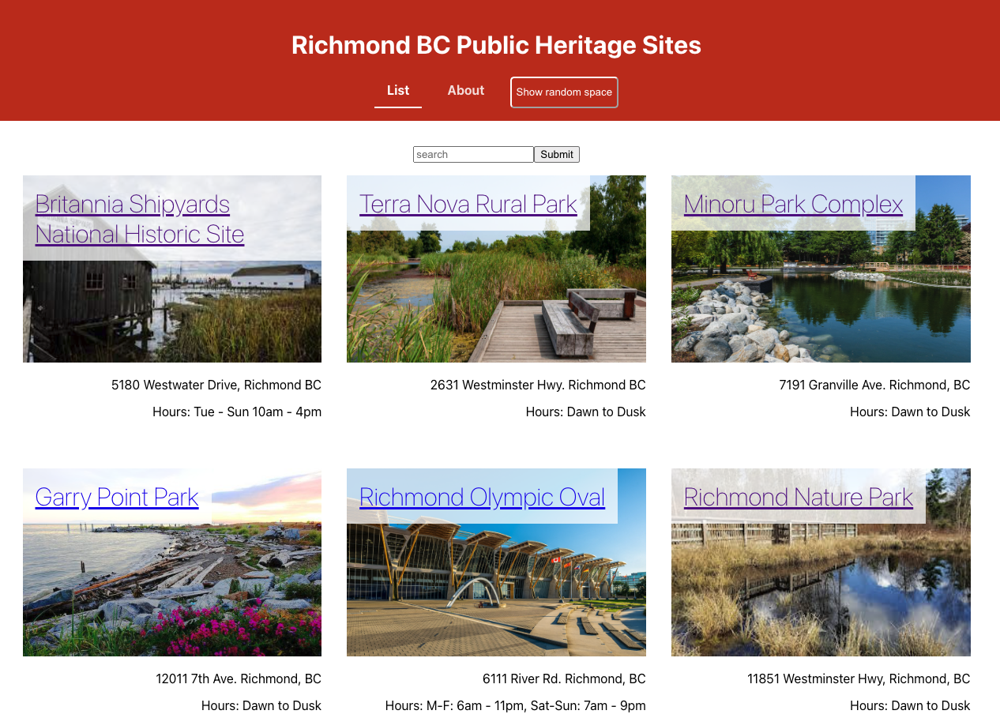

# Richmond Public Heritage Sites

This project showcases a collection of public spaces that have historical or cultural heritage significance in Richmond, BC, Canada using React.

## Installation

To install dependencies, run `npm install` in the root director.

## Expected Output

